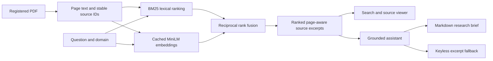

# Legal Lens 2.0 architecture

The supported application is a Next.js/React/TypeScript dashboard and a FastAPI/Pydantic backend. SQLite stores feedback. Local PDFs are the source of truth for research results; OpenAI generation is optional. Home, login, and register URLs redirect to the dashboard. Account routes are not mounted.

## Shared retrieval path

Search and chat call the same PDF retrieval service. Sources include `id`, `document_id`, `title`, PDF `page`, `excerpt`, `url`, `corpus_status`, `score`, and `rank`. Page numbers refer to the PDF viewer's physical page index, which may differ from printed book page numbers. Source URLs include the full PDF SHA-256 (`?version=...#page=N`). The server returns HTTP 409 if the current file no longer matches that version; rerun the search to obtain current citations. A PDF fragment opens the document at the physical page when the viewer supports it.

Text is chunked within each PDF page (up to 1,100 characters, 140-character overlap), preserving physical page provenance. BM25 is always the lexical baseline. Hybrid retrieval combines lexical and cached MiniLM dense rankings using RRF with a rank constant of 60. A lexical match is required before dense expansion; explicit section-number queries retain that number in eligible passages. This conservative heuristic can miss purely semantic matches and is not a legal provision parser. RRF scores are ranking values, not confidence probabilities or legal accuracy. Model loading on requests is local-only. If dense retrieval fails, results identify BM25 as the actual method and carry a warning; dense setup is retried after a cooldown. Embeddings use a content/model-keyed array cache without pickle deserialization.

## Sources and trust boundary

A fixed domain-to-document registry resolves configured paths. The bundled IPC book is labeled **historical**; user-configured replacements are **unverified**. Missing sources are unavailable. `GET /sources/{document_id}/pdf` accepts a registered identifier rather than an arbitrary filesystem path. The API does not ingest user uploads or fetch arbitrary external document URLs.

Only the IPC book is bundled by default. IPC and general can refer to the same registered book. Other domains require explicit PDFs. A corpus label describes provenance status, not a legal determination that a passage remains in force. Verified current statutes, effective-date metadata, amendments, and an IPC-to-BNS legal crosswalk are not implemented.

## Assistant and failure behavior

`POST /chatbot/{domain}` accepts the current question, bounded request history, retrieval method, and `answer_mode`. Excerpt mode returns retrieved text directly without a provider call. Auto mode attempts generation when a key is configured. The generation path requests a JSON answer and validates returned source identifiers against the retrieved evidence; malformed output must not be presented as a successfully grounded answer.

The response exposes the actual mode (`generated`, `excerpts`, or `no_evidence`), a reason, sources, retrieval metadata, and a request ID. Citation validation bounds references to available evidence; it cannot prove entailment or legal correctness. Missing evidence is surfaced rather than inventing a source. A conservative keyword guard declines explicitly current-law/BNS/BNSS/BSA questions on the historical IPC corpus before any provider call; this is a scope guard, not a complete legal-intent classifier.

Provider calls have a 30-second timeout and no SDK retry loop. Provider state is process-local: authentication/quota failures suppress calls for 300 seconds, transient failures for 60 seconds. During that cooldown retrieval remains available through excerpts. Restart after replacing the environment key/model; expiry permits a new provider attempt. This is a single-process local-demo circuit, not distributed rate limiting.

Chat history is held in the current browser page and submitted with each request. It survives changes to the search method. Switching the corpus or refreshing clears the conversation, and the composer states that behavior. The backend has no shared user conversation memory. API keys stay on the server. Generated-answer requests send the question and retrieved context to the configured provider.

## Frontend and research brief

The dashboard exposes source-backed retrieval, assistant mode/status, source links, and a Markdown brief export. Sources remain inspectable alongside the research output. Exported briefs carry the source context and corpus limitation so a downloaded result is not mistaken for verified current-law advice. The interface reports request errors and missing domains explicitly.

## Retained compatibility paths

- `/search/bm25` reads a CSV specified by `DATA_PATH`, or a labeled small demo corpus. This legacy path is separate from shared PDF retrieval.
- `/knowledge-graph/generate` and `/rerank/cosine` use the first 50 words per supplied document, TF-IDF cosine similarity, and average within-set similarity. They do not extract legal entities or measure query relevance.
- `/feedback/submit` validates a non-empty message and stores it using SQLAlchemy/SQLite.

Legacy Flask, Streamlit, notebooks, and Llama experiments are preserved but are not part of the supported runtime.

## Deployment and state

`backend/.env` loads before settings; process environment wins. `NEXT_PUBLIC_API_URL` is the browser-visible address, baked into the frontend production build. CORS currently allows only the two local dashboard origins. Public deployment requires deliberate origin, access-control, request-budget, and HTTPS configuration.

Docker Compose uses one CPU backend and one frontend. The backend's instance volume holds SQLite, embeddings, and the optional model cache. Source PDFs mount read-only. The image also includes the bundled book for use without that bind mount. The build context excludes `.env`, databases, logs, local caches, and historical code. No embedding model or credential is included in the image. See [deployment notes](docs/DEPLOYMENT.md).

Build-only CI verifies code/dependency consistency; it is not legal evaluation. No performance, retrieval-quality, or answer-accuracy benchmark is claimed in this release. `/health` reports provider configuration with provider health explicitly `not_checked`; it does not initialize retrieval or establish provider readiness.
