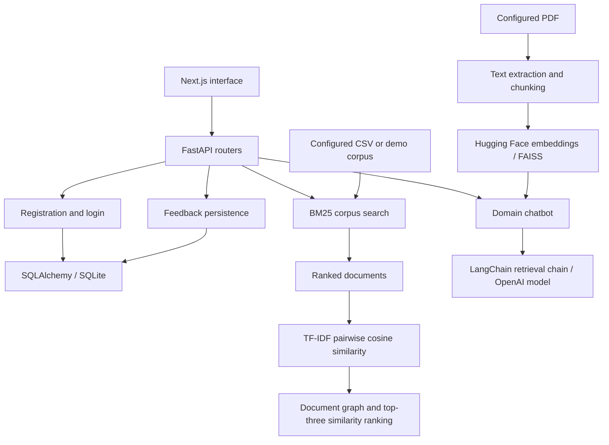

# Legal Lens

A collaborative legal information retrieval prototype combining BM25 search, TF-IDF document-similarity analysis and a separate PDF-based RAG chatbot, with a FastAPI backend and Next.js interface.

## Why this project exists

Legal documents are difficult to search and compare. Legal Lens explores two ways to make them easier to navigate: lexical retrieval with a document-similarity view, and conversational retrieval over a configured legal PDF.

The repository contains the original CSE508 group project and a newer full-stack application. It is a prototype with remaining evaluation, dependency and session-isolation work; no production-readiness or answer-accuracy claim is made.

## Architecture



The search/graph workflow and the chatbot use separate data paths. BM25 results are not currently passed into the chatbot as context.

## Engineering highlights

- Separates HTTP routes, request/response schemas, persistence and retrieval services.
- Lazily builds and caches a BM25 index over a configured corpus.
- Returns document text, names, scores and ranks through a search API.
- Exposes a TF-IDF similarity graph and a top-three document-similarity ranking.
- Implements PDF text extraction, chunking, dense retrieval and LLM generation for a domain-selected chatbot.
- Includes bcrypt password hashing, JWT login, database-backed user/feedback records and a React interface.

## Tech stack

| Area | Technologies |
| --- | --- |
| Backend | Python, FastAPI, Pydantic, SQLAlchemy, SQLite |
| Authentication | bcrypt, JWT |
| Retrieval and ranking | rank-bm25, pandas, NumPy, scikit-learn, NetworkX |
| RAG | PyPDF2, LangChain, Hugging Face embeddings, FAISS, OpenAI model API |
| Frontend | Next.js, React, TypeScript, Tailwind CSS, vis-network |
| Earlier experiments | Jupyter, Flask, Streamlit, local Llama/FAISS experiments |

## How it works

### Retrieval and ranking

1. Read a CSV containing `text` and `name` columns, or use the built-in three-document demonstration corpus.
2. Preprocess corpus/query text and retrieve positive-scoring BM25 results, with a default limit of 10.
3. Send selected results to the graph service, which represents each document using at most its first 50 words.
4. Compute TF-IDF vectors and pairwise cosine similarities, then visualize weighted document connections.
5. Return three documents ordered by their average similarity to the other documents, including self-similarity.

This second ranking measures similarity within the retrieved set. It is not a query-aware relevance reranker, and the graph does not perform legal entity/relation extraction.

### RAG chatbot

1. Select a domain and resolve its configured PDF; absent domain files can fall back to the bundled Indian Penal Code PDF.
2. Extract PDF text and split it with configured chunk size 900 and overlap 100 characters.
3. Create Hugging Face embeddings and an in-memory FAISS index.
4. Use a LangChain conversational retrieval chain to retrieve context and call the OpenAI chat model selected in code.

The current service uses `gpt-3.5-turbo` and a chain cache per domain. It does not fine-tune a model, isolate conversation memory per user, or return structured source citations.

## Setup

```bash
git clone https://github.com/YashwantRana23/CSE508_Winter2024_Project.git
cd CSE508_Winter2024_Project/backend
python -m venv .venv
```

Activate with `source .venv/bin/activate` on Linux/macOS or `.venv\Scripts\Activate.ps1` in Windows PowerShell. Set a fresh `SECRET_KEY` in the process environment before startup (configuration details below), then run locally:

```bash
python -m pip install -r requirements.txt
python -m uvicorn app.main:app --host 127.0.0.1 --port 8000
```

The backend listens on port 8000; API documentation is at `http://localhost:8000/docs`. In another terminal, from the repository root:

```bash
cd frontend
npm ci
npm run dev
```

Open `http://localhost:3000`.

Configuration:

| Setting | Purpose |
| --- | --- |
| `DATA_PATH` | Optional BM25 CSV; relative paths resolve from the project root. |
| `SECRET_KEY` | JWT signing secret; set it in the process environment before startup. |
| `OPENAI_API_KEY` | Enables the external LLM call for the optional chatbot. |
| `CHATBOT_IPC_PDF`, `CHATBOT_MURDER_PDF`, `CHATBOT_CHILD_PDF`, `CHATBOT_MATERNITY_PDF` | Optional chatbot document paths. |
| `DATABASE_URL` | Optional database URL; SQLite is the default. |
| `NEXT_PUBLIC_API_URL` | Frontend API URL; defaults to `http://localhost:8000`. |

The backend reads an optional `backend/.env`; the frontend uses `frontend/.env.local`. Example environment files are not currently included. Early backend settings are read before dotenv initialization, so supply the signing secret/database settings as process environment variables.

**Reproduction gaps:** requirements use broad version ranges and the chatbot relies on older LangChain import paths. FAISS is imported by the chatbot but its runtime package is missing from `backend/requirements.txt`; a compatible installation such as `faiss-cpu` is needed. Validate/pin a compatible environment before treating the full chatbot setup as reproducible. Search and graph exploration do not require an LLM API key.

## Example query flow

Submit `maternity benefit` to `POST /search/bm25`:

```json
{"query": "maternity benefit", "top_k": 10}
```

The API returns a `results` list with `text`, `name`, `score` and `rank`. The demonstration corpus includes `maternity.txt`. The dashboard's **Process** action submits retrieved documents to `/knowledge-graph/generate` to obtain graph nodes, weighted edges and the top-three similarity ranking.

A chatbot request goes separately to `/chatbot/{domain}` with a message; it retrieves from that domain's PDF rather than the search results.

## Engineering challenges

- **Ranking quality:** average inter-document similarity favors central documents; a labeled query set is needed to compare this heuristic with query-aware rerankers.
- **Session isolation:** cached domain chains currently share conversation memory across callers, and the supplied history argument is not applied. Per-user/session state is needed before multi-user chatbot use.
- **Data coverage:** fallback documents keep the prototype explorable but do not establish domain coverage or current legal completeness.
- **Reproducibility:** dependency compatibility, missing FAISS packaging and environment initialization need tightening. Automated end-to-end evaluation and deployment validation are not included.

## Future improvements

- Add dependency locks, complete environment examples and smoke tests for each workflow.
- Isolate chatbot sessions and return retrieved passages with source/page references.
- Evaluate BM25, query-aware reranking and dense/hybrid retrieval on labeled queries.
- Make the LLM model/provider configurable and report grounded-answer evaluation separately from retrieval metrics.
- Add corpus provenance/versioning and confirm redistribution terms for sample documents.
- Apply consistent API access controls and document deployment configuration.

## Contributors and project history

Developed as **CSE508 Winter 2024, Group 44**, with contributions from:

- Harsh Patel — MT23056
- Sahil More — MT23079
- Sarthak Pol — MT23082
- Vinayak Katoch — MT23105
- Yashwant Rana — MT23107

The original notebooks, Flask/Streamlit components and Llama experiments remain in the repository. The `backend/` and `frontend/` directories contain the later FastAPI/Next.js application; [the refactor commit](https://github.com/YashwantRana23/CSE508_Winter2024_Project/commit/d681f4b01e1ca9872389c9a47ae59097a888d7a0) is attributed to `yashwant938`. This is collaborative work, not a sole-authorship claim.

Original project references: [legal-document structuring corpus](https://arxiv.org/abs/2201.13125), [legal judgment prediction](https://arxiv.org/abs/2112.06370), [Indian court judgment NER](https://arxiv.org/abs/2211.03442), and [LegalEval](https://arxiv.org/abs/2304.09548).

